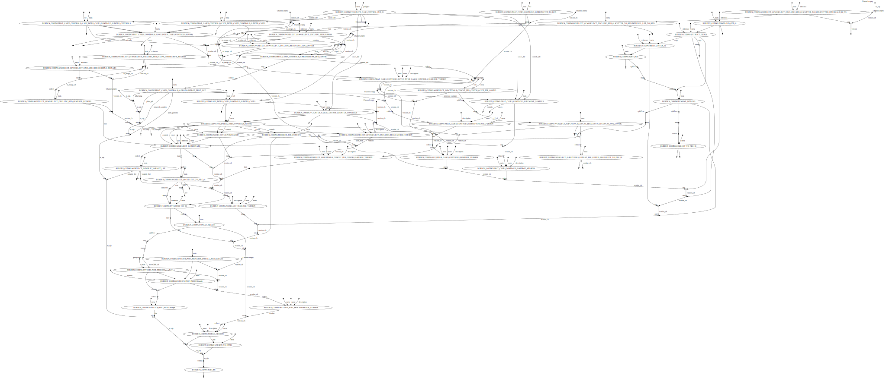

# burdencoding


## About


Burden test for rare variants in coding regions.


## System Requirement


You ll need an install of nextflow. On the Bird cluster, it s available via `module`

As I m lazy, the current workflows use local modules, local softwares that may change etc... so it could break your instance of running workflows espcially if it is an old version.
In the future every should move to  `docker` `singularity` etc...


```bash
module purge
module load nextflow
```

## Installation


If it was not already done clone the repo.

```bash
git clone https://gitlab.univ-nantes.fr/pierre.lindenbaum/gazoduc-nf.git
```

or if you re using github

```bash
git clone https://github.com/lindenb/gazoduc-nf.git
```

If the git repository was already installed update the code if needed

```bash
cd gazoduc-nf
git pull origin master
```

It s also a good practice that you clone the [repo](https://git-scm.com/book/en/v2/Git-Basics-Getting-a-Git-Repository) if you need to modify it.

Also if your lab notebook is git-based (of course it is!) you should keep `gazoduc-nf` as a git [submodule](https://git-scm.com/book/en/v2/Git-Tools-Submodules).


On **BiRDCluster** you can also define the following env variables.
```bash
export CAPSULE_CACHE_DIR=/LAB-DATA/BiRD/users/${USER}/.nextflow/capsule
```


## Pedigree


A **pedigree** is a tab delimited file without header with the following columns
 
 * family
 * individual (should match the sample name in a VCF  if any)
 * father-id or 0
 * mother-id or 0
 * sex use  `male`  or  `female` or  `0`
 * phenotype# use MACRO_CODE(case) or MACRO_CODE(control) or MACRO_CODE(0)


## Parameters


Parameters can be specified on the command line by prefixing the parameter name with a double dash character e.g. --input.

| Parameters | Default Value | Description | Defined in  |
| --- | --- | --- |
| --vcf | "NO_FILE" |  indexed VCF or a list of vcf with the .list suffix  | ../../../confs/by_workflow/wgselect.basic.cfg |
| --pedigree | "NO_FILE" |  pedigree  | ../../../confs/by_workflow/wgselect.basic.cfg |
| --bed | "NO_FILE" |  limit to that bed  | ../../../confs/by_workflow/wgselect.basic.cfg |
| --prefix | "" |  files will be generated with this prefix .eg: "20230101.hello."  | ../../../confs/default.params.cfg |
| --help | false |  should you print the help and exit ?  | ../../../confs/default.params.cfg |
| --publishDir | "" |  base directory where results will be written  | ../../../confs/default.params.cfg |
| --genomeId | "" |  genome identifier in gazoduc-nf/confs/params.genomes. e.g: "hs37d5"  | ../../../confs/genomeId.params.cfg |
| --burden.with_pihat | false |  run a pihat before the burden itself  | ../../../confs/by_subworkflow/burden.config |
| --burden.rvtests_phenotype_name | "y1" |  name of the pedigree for rvtest  | ../../../confs/by_subworkflow/burden.config |
| --burden.rvtest_arguments | "--burden cmc,zeggini,mb,fp,exactCMC,cmcWald,rarecover,cmat --vt price,analytic --kernel 'skat[nPerm=1000],kbac,skato'" |  parameters for rvtest  | ../../../confs/by_subworkflow/burden.config |
| --wgselect.distance | "10mb" |  when splitting vcf into parts, make interval of that distance  | ../../../confs/by_subworkflow/wgselect.config |
| --wgselect.min_distance | "100" |  when splitting vcf into parts, don't leave variant if distance lower that this value  | ../../../confs/by_subworkflow/wgselect.config |
| --wgselect.bcftools_options | "" |  option for first bcftools, e.g: --apply-filters '.,PASS'  | ../../../confs/by_subworkflow/wgselect.config |
| --wgselect.gatk_hardfiltering_percentile | 0.001 |  apply gatk hard filtering ignore if < 0  | ../../../confs/by_subworkflow/wgselect.config |
| --wgselect.f_missing | 0.05 /* Note: setting params.pihat.f_missing raised a bug */ |  fraction of missing allele  | ../../../confs/by_subworkflow/wgselect.config |
| --wgselect.with_rmsk | true  |  filter out variant overlapping repeat masker data in ucsc  | ../../../confs/by_subworkflow/wgselect.config |
| --wgselect.with_encode_exclude | true |  filter out variants in encode blacklisted  | ../../../confs/by_subworkflow/wgselect.config |
| --wgselect.with_lcr | true |  filter out variants in low complexity region  | ../../../confs/by_subworkflow/wgselect.config |
| --wgselect.with_simple_repeats | true |  filter out variant overlapping  ucsc  simple repeat  | ../../../confs/by_subworkflow/wgselect.config |
| --wgselect.max_alleles_count | 3 |  max alleles per variant  | ../../../confs/by_subworkflow/wgselect.config |
| --wgselect.polyx | 10 |  max polyx for jvarkit/vcfployx  | ../../../confs/by_subworkflow/wgselect.config |
| --wgselect.with_kinship | false |  use kinship : not sure it is still used  | ../../../confs/by_subworkflow/wgselect.config |
| --wgselect.fisherh | -1.0 |  remove variant having a low p-value case vs controls ignore if < 0  | ../../../confs/by_subworkflow/wgselect.config |
| --wgselect.soacn | "SO:0001629,SO:0001818" |  keep so consequences  | ../../../confs/by_subworkflow/wgselect.config |
| --wgselect.gnomadPop | "AF_nfe" |  GNOMAD population  | ../../../confs/by_subworkflow/wgselect.config |
| --wgselect.gnomadAF | 0.01  |  gnomad max allele frequency  | ../../../confs/by_subworkflow/wgselect.config |
| --wgselect.minGQsingleton | 90 |  | ../../../confs/by_subworkflow/wgselect.config |
| --wgselect.lowGQ | 50 |  | ../../../confs/by_subworkflow/wgselect.config |
| --wgselect.annot_method | "snpeff" |  | ../../../confs/by_subworkflow/wgselect.config |
| --wgselect.minDP | 10 |  remove variant mean called genotype depth is tool low  | ../../../confs/by_subworkflow/wgselect.config |
| --wgselect.maxDP | 300 |  remove variant mean called genotype depth is tool high  | ../../../confs/by_subworkflow/wgselect.config |
| --wgselect.lowGQ | 70 |  ALL genotypes carrying a ALT must have a Genotype Quality GQ >= x. Ignore if x <=0  | ../../../confs/by_subworkflow/wgselect.config |
| --wgselect.with_count | true |  Count variants at each step of wgselect  | ../../../confs/by_subworkflow/wgselect.config |
| --wgselect.with_homvar | true |  remove variant on autosome if no HET and found at least one HOM_VAR  | ../../../confs/by_subworkflow/wgselect.config |
| --wgselect.maxmaf | 0.1 |  remove variant if internal MAF is too high. Disable if < 0  | ../../../confs/by_subworkflow/wgselect.config |
| --wgselect.fisherh | 0.05 |  fisher horizontal : remove variant if fisher test per variant is lower than 'x'. Disable if <0.  | ../../../confs/by_subworkflow/wgselect.config |
| --wgselect.hwe | 0.000000000000001 |  remove variants with HW test. Ask Floriane :-P . Disable if <0.  | ../../../confs/by_subworkflow/wgselect.config |
| --wgselect.with_contrast | true |  Apply bcftools contrast on VCF  | ../../../confs/by_subworkflow/wgselect.config |
| --wgselect.inverse_so | false |  inverse output of vcffilterso  | ../../../confs/by_subworkflow/wgselect.config |
| --wgselect.minGQsingleton | 99 |  remove variant if singleton has bad GQ < x  | ../../../confs/by_subworkflow/wgselect.config |
| --wgselect.minRatioSingleton | 0.2 |  emove variant if HET singleton has AD ratio out of x< AD/ratio < (1.0-x)  | ../../../confs/by_subworkflow/wgselect.config |
| --wgselect.annot_method | "snpeff" |  how to annotate ? 'vep' or 'snpeff'  | ../../../confs/by_subworkflow/wgselect.config |
| --wgselect.cadd_phred | -1.0 |  Discard variants having CADD phred treshold < 'x'. Ignore if 'x' < 0.0 or --wgselect_cadd_tabix is not defined.  | ../../../confs/by_subworkflow/wgselect.config |
| --wgselect.gnomadgenomefilterexpr_hg19 | "FILTER~\"GNOMAD_GENOME_BAD_AF\"|| FILTER~\"GNOMAD_GENOME_InbreedingCoeff\"|| FILTER~\"GNOMAD_GENOME_RF\"" |  remove gnomad hg19 expression  | ../../../confs/by_subworkflow/wgselect.config |
| --wgselect.gnomadgenomefilterexpr_hg38 | "FILTER~\"GNOMAD_GENOME_BAD_AF\"|| FILTER~\"GNOMAD_GENOME_InbreedingCoeff\"|| FILTER~\"GNOMAD_GENOME_AS_VQSR\"" |  remove gnomad hg38 expression  | ../../../confs/by_subworkflow/wgselect.config |
| --wgselect.cadd_phred | -1.0 |  TODO  | ../../../confs/by_subworkflow/wgselect.config |


The workflow can be executed using the following command.

```bash
module purge

module load nextflow

nextflow -c "../../gazoduc-nf/confs/${HOSTNAME}.cfg" \
        -c /path/to/MACRO_MAIN_CONFIG \
	run \
	-resume \
	-work-dir "/SCRATCH-BIRD/users/${USER}/WORKDIR/" \
	gazoduc-nf/burden/burden.coding.01/burden.coding.01.nf \
	--vcf /path/to/vcf \
	--genomeId hs37d5 \
        --prefix "20230906.projectName.hs37d5." \
        --publishDir "/SCRATCH-BIRD/users/${USER}/work/projectName/PUBLISH" \
	--pedigree "/path/to/file.ped" \
	--bed /path/to/input.bed 


```

where 

 - `./../gazoduc-nf/confs/${HOSTNAME}.cfg` is a config allowing to run the SGE job manager on the BirdCluster or SLURM on CCIPL.
 - `/path/to/MACRO_MAIN_CONFIG`: is the config file containing all the parameters
 - `-resume` tell nextflow NOT to restart everything from scratch
 - `/SCRATCH-BIRD/users/${USER}/WORKDIR/` is the directory where nextflow will produce the results.
 - `gazoduc-nf/burden/burden.coding.01/burden.coding.01.nf` is the main nextflow script


## Ouput


Output files are usually available under `{params.publishDir}/results`.

## On Error


TODO

## Workflow




## Author


 + Pierre Lindenbaum PhD Institut du Thorax. Nantes. France.


