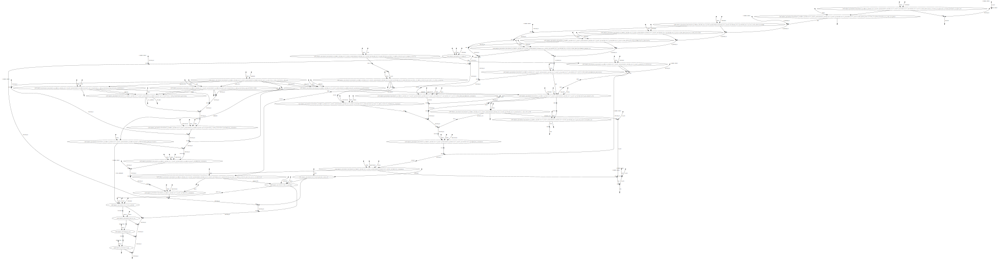

N E X T F L O W  ~  version 22.04.0
Launching `/LAB-DATA/BiRD/users/lindenbaum-p/notebook/gazoduc-nf/workflows/burden/optimize.rvtests/optimize.rvtests.01.nf` [exotic_lavoisier] DSL2 - revision: 5eb03e5620

## About

optimize burden using sliding window of variants.

## Author

Pierre Lindenbaum PhD. Institut du Thorax. 44000 Nantes. France

## Options

  * --reference (fasta) The full path to the indexed fasta reference genome. It must be indexed with samtools faidx and with picard CreateSequenceDictionary or samtools dict. [REQUIRED]
  * --vcf <file> path to a indexed VCF or BCF file. If file ends with '.list' is a list of path to one VCF per contig [REQUIRED]
  * --pedigree <file> jvarkit formatted pedigree. phenotype MUST be case|control. Sex MUST be male|female|unknown
  * --publishDir (dir) Save output in this directory
  * --prefix (string) files prefix. default: ""

## Usage

```
nextflow -C ../../confs/cluster.cfg  run -resume workflow.nf \
        --publishDir output \
        --prefix "analysis." \
        --reference /path/to/reference.fasta \
        --vcf /path/to/my.vcf.gz \
        --pedigree /path/to/input.ped ```

## Workflow




