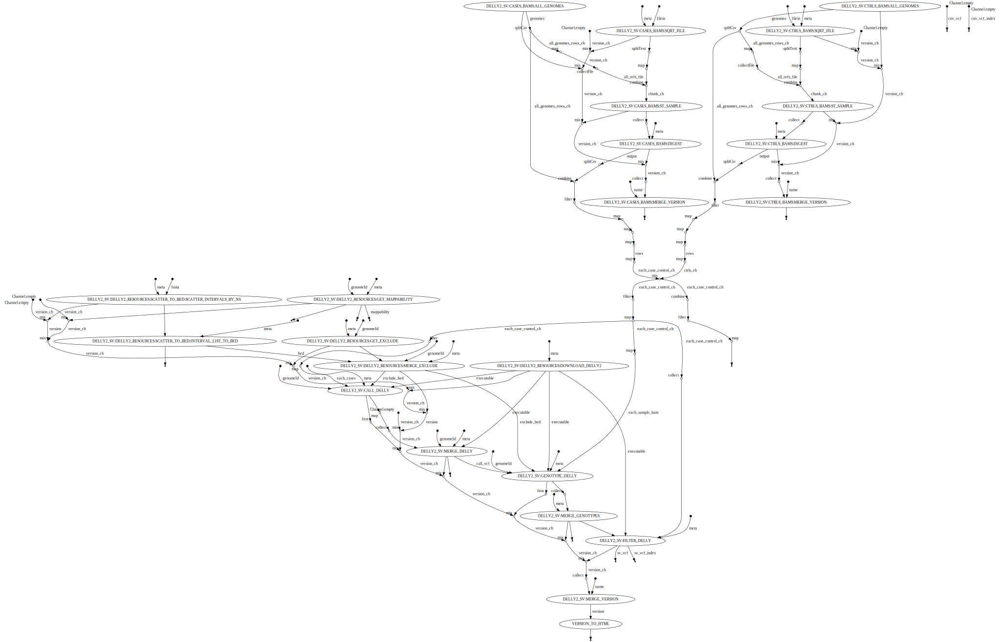

WARN: Access to undefined parameter `delly2_version` -- Initialise it to a default value eg. `params.delly2_version = some_value`

## About

Detects CNV/SV using delly2

## Author

Pierre Lindenbaum PhD. Institut du Thorax. 44000 Nantes. France.

## Options

  * --reference (fasta) indexed fasta reference [REQUIRED]
  * --cases (file) one file containing the paths to the BAM/CRAM for cases [REQUIRED]
  * --controls (file) one file containing the paths to the BAM/CRAM for controls [REQUIRED]
  * --publishDir (dir) Save output in this directory
  * --prefix (string) files prefix. default: ""
  * --delly2_version (string) default: "null"
  * --cnv (boolean) Shall we call CNV ? default: "true"
  * --bnd (boolean) Shall we output BND ? default: "true"

## Usage

```
nextflow -C ../../confs/cluster.cfg  run -resume delly.nf \
	--publishDir output \
	--prefix "analysis." \
	--reference /path/to/reference.fasta \
	--cases /path/to/bams.cases.list \
	--controls /path/to/bams.controls.list
```

## Workflow


  
## See also

  * https://github.com/dellytools/delly


