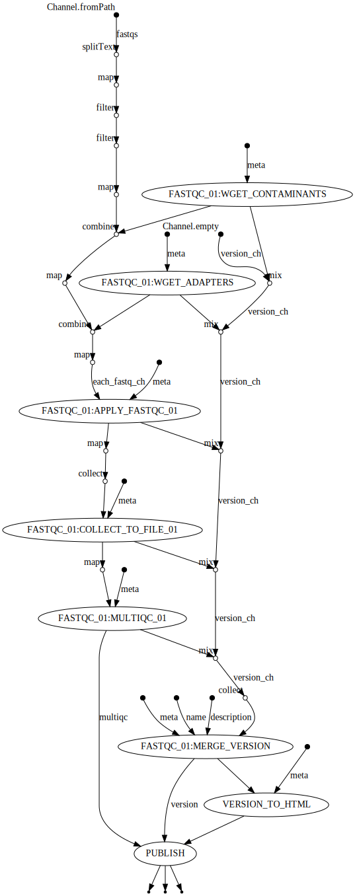

## About

run FASTC for a list of bams

## Author

Pierre Lindenbaum PhD. Institut du Thorax. 44000 Nantes. France

## Options

  * --fastqs (file) list of fastqs one per line [REQUIRED]
  * --publishDir (dir) Save output in this directory
  * --prefix (string) files prefix. default: ""

## Usage

```
nextflow -C ../../confs/cluster.cfg  run -resume fastqc.nf \
	--publishDir output \
	--prefix "analysis." \
	--reference /path/to/reference.fasta \
	--fastqs paths.list
```

## Workflow


  
## See also


