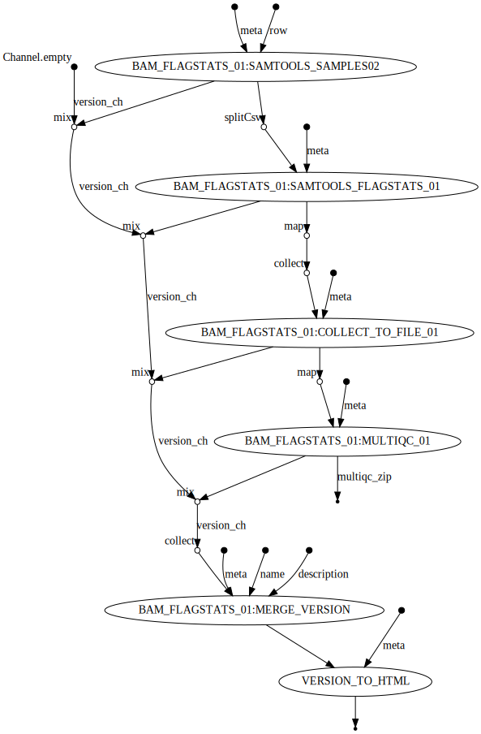

## About

apply samtools flagstats for a set of bams

## Author

Pierre Lindenbaum PhD. Institut du Thorax. 44000 Nantes. France

## Options

  * --reference (fasta) The full path to the indexed fasta reference genome. It must be indexed with samtools faidx and with picard CreateSequenceDictionary or samtools dict. [REQUIRED]
  * --references 
  * --bams (file) one file containing the paths to the BAM/CRAM [REQUIRED]
  * --publishDir (dir) Save output in this directory
  * --prefix (string) files prefix. default: ""

## Usage

```
nextflow -C ../../confs/cluster.cfg  run -resume mosdepth.nf \
	--publishDir output \
	--prefix "analysis." \
	--references /path/to/references.txt \
	--bams /path/to/bams.list
```

## Workflow


  
## See also


