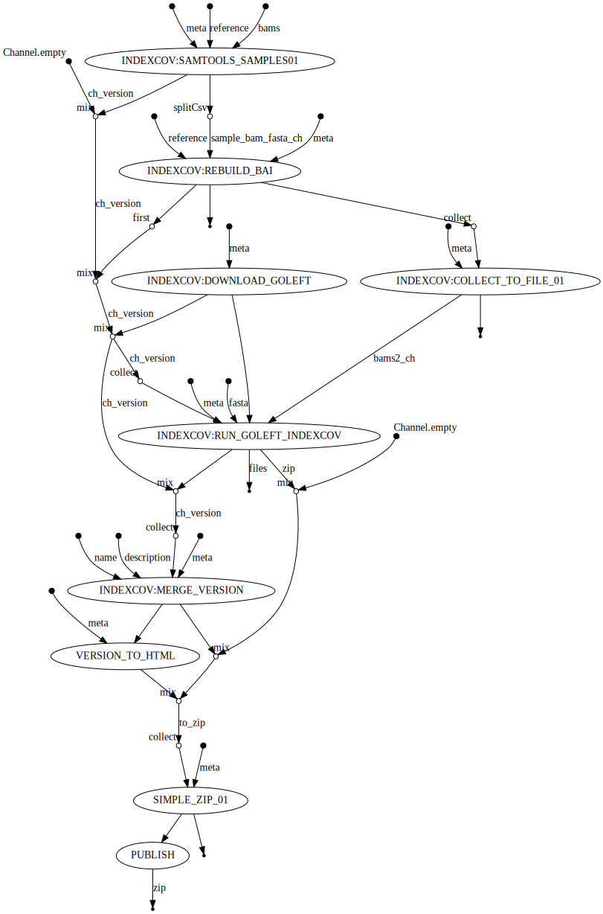

## About

Detects CNV using go-left indexcov

## Author

Pierre Lindenbaum PhD. Institut du Thorax. 44000 Nantes. France

## Options

  * --reference (fasta) The full path to the indexed fasta reference genome. It must be indexed with samtools faidx and with picard CreateSequenceDictionary or samtools dict. [REQUIRED]
  * --bams (file) one file containing the paths to the BAM/CRAM [REQUIRED]
  * --mapq (int)  min mapping quality . If it's lower than 0 (this is the default) just use the bam index as is. Otherwise, rebuild the bai
  * --publishDir (dir) Save output in this directory
  * --prefix (string) files prefix. default: ""
  * --goleft_version (string) default: "v0.2.4"

## Usage

```
nextflow -C ../../confs/cluster.cfg  run -resume /LAB-DATA/BiRD/users/lindenbaum-p/notebook/gazoduc-nf/workflows/indexcov/indexcov.nf \
	--publishDir output \
	--prefix "analysis." \
	--reference /path/to/reference.fasta \
	--bams /path/to/bams.list \
	--mapq 30
```

## Workflow


  
## See also

 * indexcov: https://github.com/brentp/goleft/tree/master/indexcov
 * https://twitter.com/yokofakun/status/1527419449669734426


