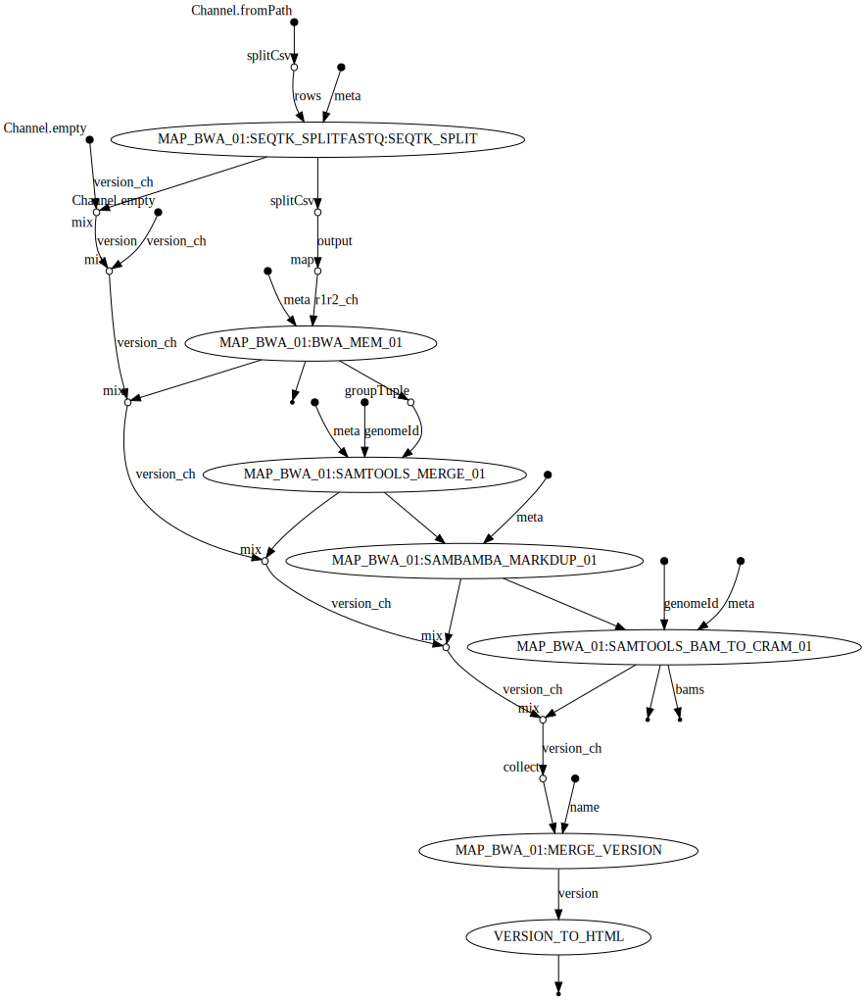

## About

map fastqs on a reference genome

## Author

Pierre Lindenbaum PhD. Institut du Thorax. 44000 Nantes. France

## Options

  * --reference (fasta) The full path to the indexed fasta reference genome. It must be indexed with samtools faidx and with picard CreateSequenceDictionary or samtools dict. [REQUIRED]
  * --fastqs (file) one file containing the paths to the BAM/CRAM. Header: 'sample(tab)R1(tab)R2' [REQUIRED]
  * --publishDir (dir) Save output in this directory
  * --prefix (string) files prefix. default: ""

## Usage

```
nextflow -C ../../confs/cluster.cfg  run -resume map.fastqs.nf \
	--publishDir output \
	--prefix "analysis." \
	--reference /path/to/referenceX.fasta \
	--fastqs /path/to/input.tsv
```

## Workflow


  
## See also


