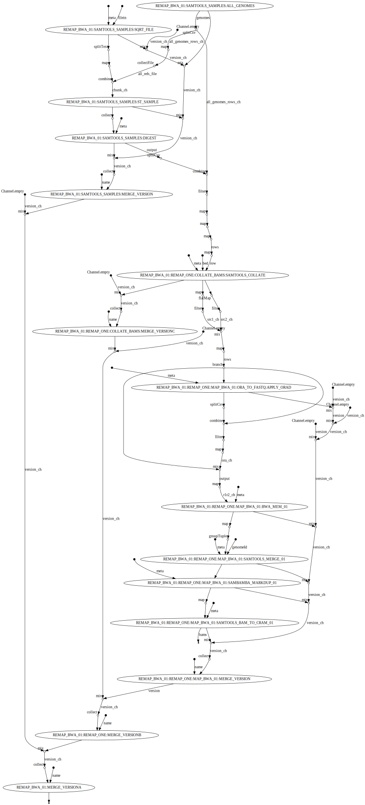

# Remap bwa

Takes a mapped set of BAM or CRAM files and remap them on a new reference

## Author(s)

  * Pierre Lindenbaum PhD. Institut du Thorax. U1087. 44400 Nantes. France.

## Options

### Main options

    * --bams <path to file> . File with the .list' suffix, containing the full path to several BAMs ir CRAM file. The BAM must be indexed with 'samtools index' (an associated .bai must be present) . [REQUIRED]. [NO_FILE].
    * --reference_in <path to file> . Reference for input BAMS. Path to the reference genome as FASTA. The file must be indexed with 'samtools faidx' and 'samtools dict' ( or picard CreateSequenceDictionary ) . [REQUIRED]. [NO_FILE].
    * --reference_out <path to file> . Reference for output BAMS. Path to the reference genome as FASTA. The file must be indexed with 'samtools faidx' and 'samtools dict' ( or picard CreateSequenceDictionary ) . [REQUIRED]. [NO_FILE].

### Help

    * --help <true|false> . Display help for this workflow and exit. [true].

### Output

    * --prefix <string> . set a suffix for the files generated for this workflow. [].
    * --publishDir <directory> . set a base directory where final output files should be written.. [].

### fastq

    * --split_fastq_ignore_if_size <long> . Do NOT split the fastq file if it's compressed size if lower than 'x' bytes.. [10000000].
    * --split_fastqs_count <integer> . Split a FASTQ produced by samtools fastq into 'N' files. [100].

### mapping

    * --bqsr_cluster_method <value> . How to group contigs with jvarkit bedcluster for applying GATK BQSR. [--size 50mb ].
    * --with_bqsr <true|false> . run gatk BQSR on bam. [true].

## Issues

report issues at https://github.com/lindenb/gazoduc-nf/issues

## Workflow

