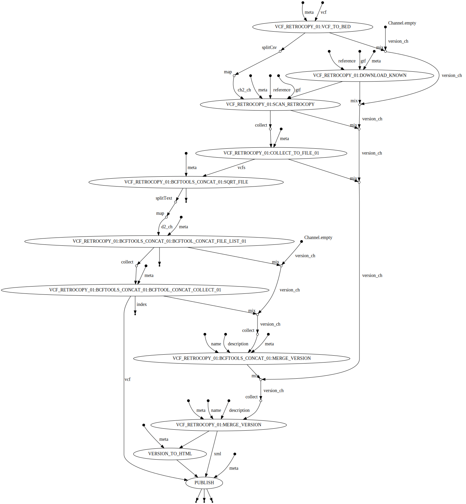

## About

find retrocopies from a SV VCF using a GTF file

## Author

Pierre Lindenbaum PhD. Institut du Thorax. 44000 Nantes. France

## Options

  * --reference (fasta) The full path to the indexed fasta reference genome. It must be indexed with samtools faidx and with picard CreateSequenceDictionary or samtools dict. [REQUIRED]
  * --vcf (file) the indexed vcf file
  * --gtf (file) tabix indexed gtf file
  * --publishDir (dir) Save output in this directory
  * --prefix (string) files prefix. default: ""

## Usage

```
nextflow -C ../../confs/cluster.cfg  run -resume vcf.retrocopy.nf  \
	--publishDir output \
	--prefix "analysis." \
	--reference /path/to/reference.fasta \
	--vcf input.vcf.gz 	--gtf data.gtf.gz
```

## Workflow


  
## See also


