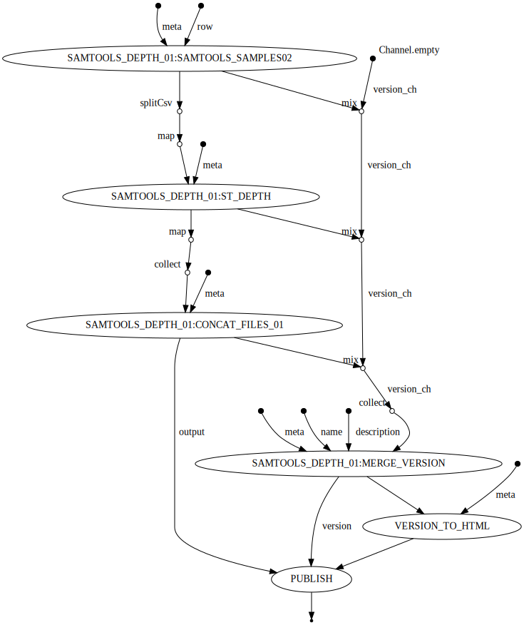

## About

apply samtools depth to a set of bams.

## Author

Pierre Lindenbaum PhD. Institut du Thorax. 44000 Nantes. France

## Options
  * --reference (fasta) The full path to the indexed fasta reference genome. It must be indexed with samtools faidx and with picard CreateSequenceDictionary or samtools dict. [REQUIRED]
  * --references (file) path to known references.
  * --bams (file) one file containing the paths to the BAM/CRAM [REQUIRED]
  * --bed (file) optional BED file. default: ""
  * --publishDir (dir) Save output in this directory
  * --prefix (string) files prefix. default: ""

## Usage

```
nextflow -C ../../confs/cluster.cfg  run -resume samtoolsdepth.nf \
	--publishDir output \
	--prefix "analysis." \
	--reference /path/to/reference.fasta \
	--bams /path/to/bams.list \
	--bed /path/to/in.bed
```

## Workflow


  
## See also


