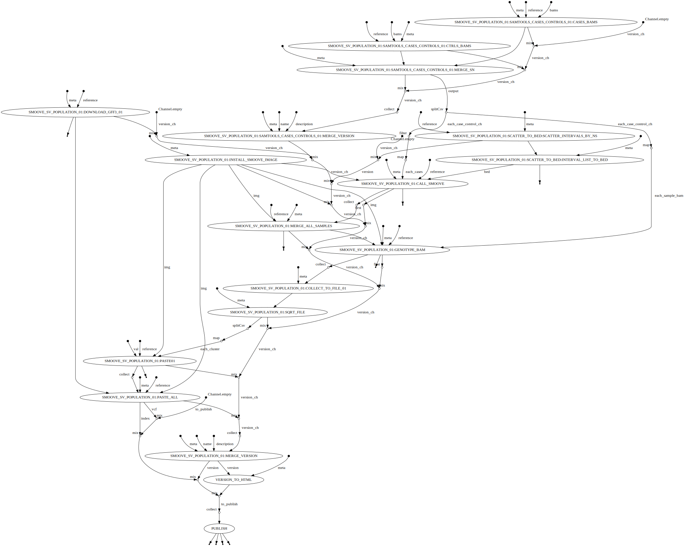

## About

Detects CNV/SV using smoove

## Author

Pierre Lindenbaum PhD. Institut du Thorax. 44000 Nantes. France

## Options

  * --reference (fasta) The full path to the indexed fasta reference genome. It must be indexed with samtools faidx and with picard CreateSequenceDictionary or samtools dict. [REQUIRED]
  * --cases (file) one file containing the paths to the BAM/CRAM for cases [REQUIRED]
  * --controls (file) one file containing the paths to the BAM/CRAM for controls
  * --publishDir (dir) Save output in this directory. default: ""
  * --prefix (string) files prefix. default: ""
  * --smoove_image (string) path to precompiled singularuty image default: ""
  * --gff3 (path/url) path to gff3 file for annotation. If blank, the default file is downloaded from the web.

## Usage

```
nextflow -C ../../confs/cluster.cfg  run -resume /LAB-DATA/BiRD/users/lindenbaum-p/notebook/gazoduc-nf/workflows/smoove/smoove.population.nf \
	--publishDir output \
	--prefix "analysis." \
	--reference /path/to/reference.fasta \
	--cases /path/to/bams.cases.list \
	--controls /path/to/bams.controls.list
```

## Workflow


  
## See also

  * https://github.com/brentp/smoove


