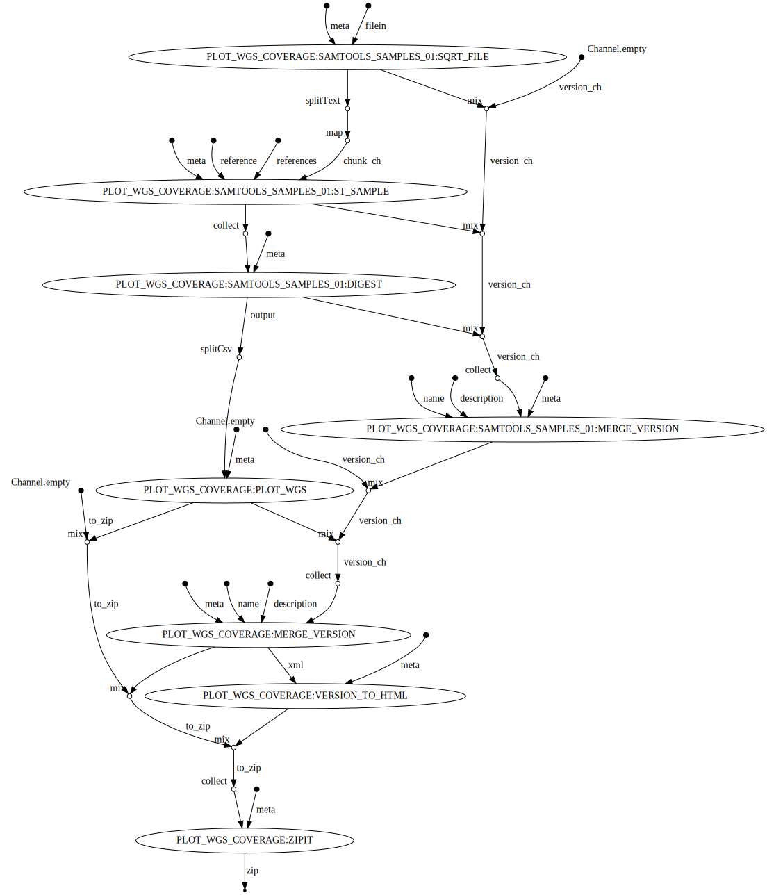

## About

plot WGS coverage as SVG

## Author

Pierre Lindenbaum

## Options

  * --reference (fasta) indexed reference [REQUIRED]
  * --bams (list) path to bams
  * --publishDir (dir) Save output in this directory
  * --prefix (string) files prefix. default: ""

## Usage

```
nextflow -C ../../confs/cluster.cfg  run -resume workflow.nf \
	--publishDir output \
	--prefix "analysis." \
	--reference /path/to/reference.fasta \
	--bams bams.list
```

## Workflow


  


