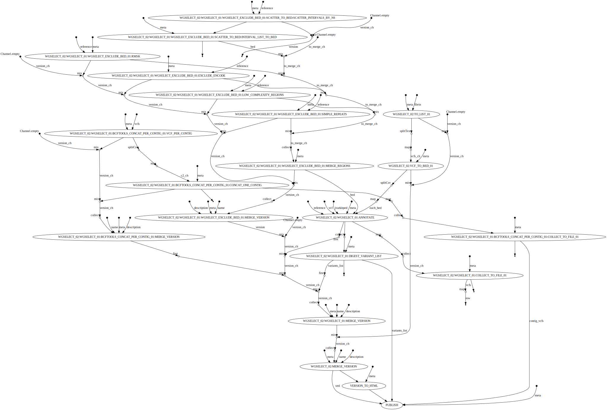

# wgselect


## About


This workflow filter out bad quality variants from a VCF file.


## System Requirement


You ll need an install of nextflow. On the Bird cluster, it s available via `module`

As I m lazy, the current workflows use local modules, local softwares that may change etc... so it could break your instance of running workflows espcially if it is an old version.
In the future every should move to  `docker` `singularity` etc...


```bash
module purge
module load nextflow
```

## Installation


If it was not already done clone the repo.

```bash
git clone https://gitlab.univ-nantes.fr/pierre.lindenbaum/gazoduc-nf.git
```

or if you re using github

```bash
git clone https://github.com/lindenb/gazoduc-nf.git
```

If the git repository was already installed update the code if needed

```bash
cd gazoduc-nf
git pull origin master
```

It s also a good practice that you clone the [repo](https://git-scm.com/book/en/v2/Git-Basics-Getting-a-Git-Repository) if you need to modify it.

Also if your lab notebook is git-based (of course it is!) you should keep `gazoduc-nf` as a git [submodule](https://git-scm.com/book/en/v2/Git-Tools-Submodules).


On **BiRDCluster** you can also define the following env variables.
```bash
export CAPSULE_CACHE_DIR=/LAB-DATA/BiRD/users/${USER}/.nextflow/capsule
```


## Pedigree


A **pedigree** is a tab delimited file without header with the following columns
 
 * family
 * individual (should match the sample name in a VCF  if any)
 * father-id or 0
 * mother-id or 0
 * sex use  `male`  or  `female` or  `0`
 * phenotype# use MACRO_CODE(case) or MACRO_CODE(control) or MACRO_CODE(0)


## Parameters


MACRO_OPTIONS(MACRO_AWK_PARAMS(../../../confs/by_workflow/wgselect.basic.cfg,)m4_dnl
MACRO_AWK_PARAMS(../../../confs/default.params.cfg,)m4_dnl
MACRO_AWK_PARAMS(../../../confs/genomeId.params.cfg,)m4_dnl
MACRO_AWK_PARAMS(../../../confs/by_subworkflow/wgselect.config,wgselect.)m4_dnl
)


The workflow can be executed using the following command.

```bash
module purge

module load nextflow

nextflow -c "../../gazoduc-nf/confs/${HOSTNAME}.cfg" \
        -c /path/to/MACRO_MAIN_CONFIG \
	run \
	-resume \
	-work-dir "/SCRATCH-BIRD/users/${USER}/WORKDIR/" \
	gazoduc-nf/workflows/wgselect/basic/main.nf \
	--vcf /path/to/vcf \
	--genomeId hs37d5 \
        --prefix "20230906.projectName.hs37d5." \
        --publishDir "/SCRATCH-BIRD/users/${USER}/work/projectName/PUBLISH" \
	--pedigree "/path/to/file.ped" \
	--bed /path/to/input.bed 


```

where 

 - `./../gazoduc-nf/confs/${HOSTNAME}.cfg` is a config allowing to run the SGE job manager on the BirdCluster or SLURM on CCIPL.
 - `/path/to/MACRO_MAIN_CONFIG`: is the config file containing all the parameters
 - `-resume` tell nextflow NOT to restart everything from scratch
 - `/SCRATCH-BIRD/users/${USER}/WORKDIR/` is the directory where nextflow will produce the results.
 - `gazoduc-nf/workflows/wgselect/basic/main.nf` is the main nextflow script


## Ouput


Output files are usually available under `{params.publishDir}/results`.

## On Error


TODO

## Workflow




## Author


 + Pierre Lindenbaum PhD Institut du Thorax. Nantes. France.


